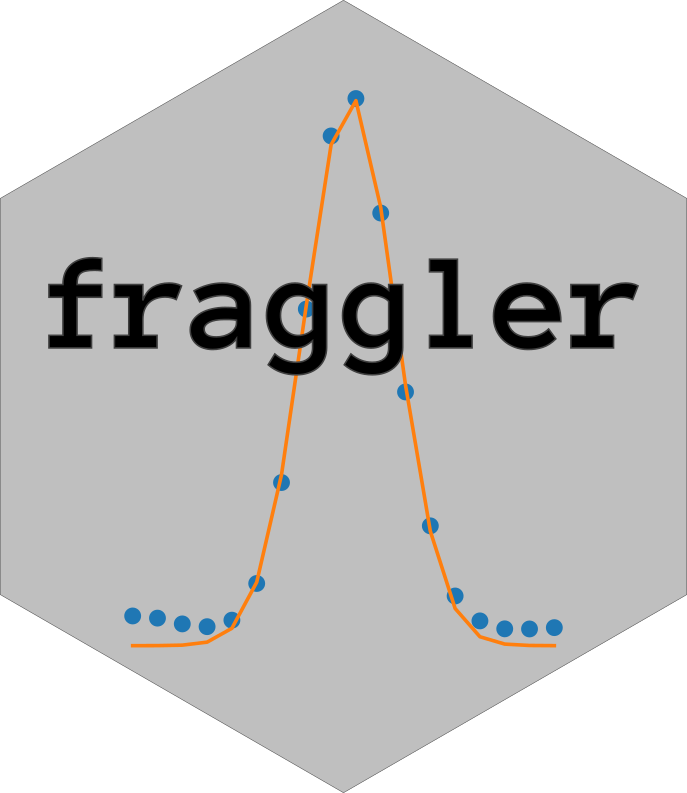

## ladder map


Matches ladders to peaks by correlation for fragment analysis. The strategy resembles the one used by [Fragman](https://cran.r-project.org/web/packages/Fragman/index.html) for R.

One difference is that combinations of peaks are generated using [NetworkX](https://networkx.org/) to eliminate impossible combinations. This reduces complexity substantially and allows for an exhaustive search to identify the best match.

## Install

```bash
pip install peak-a-py

conda install -c bioconda peak-a-py
```

## Usage

The library exists of two main classes, namely `LadderMap` and `PeakArea`. 
`LadderMap` matches ladders to peaks by correlation and stores peak and ladder information. The have methods to reassign timeseries data to basepair steps using linear regression. 

`PeakArea` calculates peak area.

### Example Usage

#### Area under curve using naive integrals
```python
from fragment_analyzer.ladder_map import LadderMap, PeakArea

data = "demo/4071_Dx 230113_PRT1_PRT3_rn/PRT3_NA18507_4071_D11_Dx.fsa"

laddermap = LadderMap(data)

peak_area = PeakArea(
    laddermap.adjusted_step_dataframe(),
    start=190, 
    end=200,
    rel_height=.97
)

peak_area.plot_peak_widths()
```

#### Output


#### Visualization of best sample ladder peaks
```python
fig = laddermap.plot_best_sample_ladder()
```
#### Output


#### Fitting model to the data
##### Voigt Distribution
```python
peak_area.plot_lmfit_model("voigt")
```
#### Output


##### Gauss Distribution
```python
peak_area.plot_lmfit_model("gauss")
```
#### Output


#### Looking at more than two peaks
```python
peak_area = PeakArea(
    laddermap.adjusted_step_dataframe(channel="DATA1"),
    start=250, 
    end=300,
    num_peaks=4,
    padding=2,
    model="voigt"
)


peak_area.plot_lmfit_model()
```
The last peak is divided by the mean of the peaks to the left of it:
#### Output


#### If data needs baseline correction and normalization:
```python
laddermap = LadderMap(data, normalize_peaks=False)
```
Messy output
#### Output


#### Normalized data:
```python
laddermap = LadderMap(data, normalize_peaks=True)
```
Normalized peaks:
#### Output


## Usage: peak_area_report

The `peak_area_report` function generates an HTML report for the fragment analysis of an FSA file, including peak area data and plots.

### Parameters:

- `fsa_file` (str): The path to the FSA file to be analyzed.
- `ladder` (str): The name of the ladder used in the FSA file.
- `folder` (str): The path to the output folder where the report will be saved.
- `peak_model` (str): The peak finding model used to identify peaks.
- `min_interpeak_distance` (int, optional, default=30): Minimum distance between peaks.
- `min_height` (int, optional, default=100): Minimum peak height for inclusion in the analysis.
- `min_ratio` (float, optional, default=0.1): Minimum peak area ratio for multiplexing.
- `trace_channel` (str, optional, default="DATA1"): The trace channel in the FSA file.
- `search_peaks_start` (int, optional, default=100): The starting point for peak search.
- `cutoff` (float, optional): Cutoff value for peak area de-multiplexing.

### Returns:

- An integer representing the status of the report generation:
  - 0 if successful
  - 1 if no peaks were found

### Raises:

- FileNotFoundError: If the specified FSA file cannot be found.
- IOError: If the report file cannot be saved.

### Example usage:

```python
result = peak_area_report(
    fsa_file="path/to/fsa_file.fsa",
    ladder="LIZ",
    folder="output_folder",
    peak_model="gauss"
)
```
This example will generate an HTML report for the fragment analysis of the specified FSA file, using the LIZ ladder and a Gaussian peak model. The report will be saved in the output_folder directory.


## Usage: generate_peak_table

The `generate_peak_table` function generates a combined dataframe of all peaks for .fsa files in the given folder, using the specified ladder and peak model.

### Parameters:

- `folder` (str): A string representing the path of the folder containing the .fsa files.
- `ladder` (str): A string representing the name of the ladder used for the fragment analysis.
- `peak_model` (str): A string representing the peak model used for peak area calculations.
- `min_height` (int, optional, default=100): Minimum peak height for inclusion in the analysis.
- `cutoff` (int, optional, default=175): Cutoff value for peak area de-multiplexing.

### Returns:

- A Pandas dataframe containing the peak positions and their corresponding areas.

### Example usage:

```python
peak_df = generate_peak_table(
    folder="my_folder", ladder="LIZ", peak_model="gauss"
)
```
This example will generate a dataframe containing the peak positions and their corresponding areas for all .fsa files in the my_folder directory, using the LIZ ladder and a Gaussian peak model.


